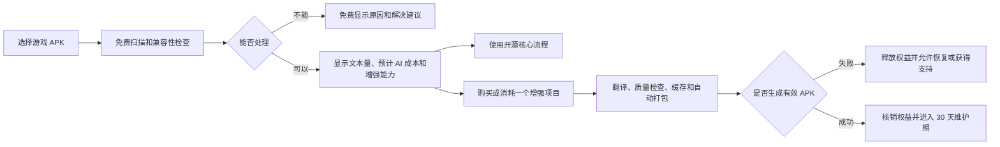

# Android 官方增强版商业化规划

## 1. 文档目的

本文档用于规划 SLG Translator Android 版的早期商业化路径。当前项目仍处于开发者自测阶段，尚无外部测试用户，因此首要目标不是立即建设完整支付系统，而是验证三件事：

1. 中国大陆的普通 Android 玩家是否确实需要一键汉化 Ren'Py 游戏；
2. 产品能否稳定地为真实游戏生成可安装、可运行的汉化 APK；
3. 用户是否愿意为更高成功率、更少操作和持续兼容服务真实付款。

本文档只覆盖 Android 官方增强版。Windows/Electron 桌面版不进入首期收费范围。

## 2. 已确认的产品决策

### 2.1 目标市场

- 首发市场：中国大陆；
- 首发平台：Android；
- 主要用户：希望玩到中文剧情，但不了解 APK 解包、Ren'Py 文本结构、签名打包或 AI 参数的普通玩家；
- 典型使用频率：每名用户每月汉化 1～2 款游戏；
- AI 成本承担方式：用户使用自己的 DeepSeek、OpenAI 或兼容服务 API Key，模型费用由用户自己的账号承担。

### 2.2 开源策略

项目长期采用“核心开源、官方增强版闭源收费”的双轨模式：

- 开源核心版保持可用，使技术用户能够检查、修改和自行运行基础汉化流程；
- 官方 Android 增强版提供更高兼容性、更低操作成本、更完整的故障恢复以及官方维护服务；
- 不把已经公开的核心能力重新加锁，也不以隐藏源代码本身作为收费理由；
- 收费价值来自持续更新的规则、自动化能力、质量保障和支持服务。

### 2.3 商业化原则

- 收取工具与服务价值费用，不重复收取用户已经支付给 AI 服务商的模型费用；
- 主要计费单位是“增强汉化项目”，不是文本条数、Token 数量或 APK 文件次数；
- 免费完成兼容性扫描，不对确认无法处理的游戏收费；
- 失败任务不重复扣费，用户能够恢复、修复和重新打包；
- 先验证真实付费，再建设完整账号和支付后端；
- 首期不出售无限量终身会员。

## 3. 收费模型选择

### 3.1 首发模型：按增强汉化项目收费

用户可以免费安装开源核心版或官方增强版，免费完成 APK 选择、扫描、兼容性检查、文本数量统计和预计 AI 成本评估。用户确认游戏可处理后，可以消耗一个“增强汉化项目”权益，使用官方增强流程。

建议作为实验起点的价格如下，后续根据真实转化和支持成本调整：

| 商品 | 实验价格 | 适用用户 |
| --- | ---: | --- |
| 单个增强项目 | ¥6.9～9.9 | 首次购买或偶尔使用 |
| 三项目包 | ¥19.9～24.9 | 每月处理 1～2 款游戏的持续用户 |
| 年度支持者方案 | ¥59～69/年，成熟后推出 | 已出现复购并希望持续获得更新的用户 |

这些价格是付费意愿测试区间，不是最终公开承诺。首次测试应保持商品结构简单，优先只发布单项目和三项目包。

### 3.2 暂不采用纯月订阅

目标用户的需求低频但持续。用户完成一两款游戏后，可能几个月没有新的汉化需求。强制月订阅容易产生“没有使用仍在扣费”的感受，导致快速取消和负面评价。

当产品未来拥有持续更新的兼容规则、活跃社区、稳定内容供给和可持续服务时，可以增加可选会员，但不应作为首发唯一付费方式。

### 3.3 暂不采用永久买断

永久买断会过早锁定未来收入，却需要长期承担新 Android 版本、新 Ren'Py 版本、复杂 APK 结构以及用户支持成本。尤其不能在早期以低价出售无限量终身权益。

## 4. 免费版与官方增强版边界

开源核心版必须能够完成基本流程；官方增强版负责提高成功率、降低操作成本和减少失败后的损失。

| 能力 | 开源核心版 | 官方 Android 增强版 |
| --- | --- | --- |
| 选择、识别和扫描标准 Ren'Py APK | 支持 | 支持 |
| 使用用户自己的 AI API Key | 支持 | 支持 |
| 基础文本提取和翻译 | 支持 | 支持 |
| 基础重新打包 | 支持 | 支持 |
| 查看原始错误日志 | 支持 | 支持 |
| 官方持续更新的兼容规则库 | 不提供或需自行配置 | 自动更新并提供 |
| 复杂游戏结构识别 | 基础规则 | 增强规则和回退策略 |
| 长任务检查点与自动恢复 | 基础能力 | 完整支持 |
| 游戏更新后的增量汉化 | 手动处理 | 自动识别与复用结果 |
| 术语、角色名和语气一致性检查 | 基础或无 | 高级检查与修改建议 |
| 标签、变量、占位符完整性保护 | 报告问题 | 自动修复或引导修复 |
| 签名、重打包与安装引导 | 基础流程 | 一键流程和结果验证 |
| 兼容问题诊断 | 技术日志 | 面向普通用户的诊断报告 |
| 官方支持 | 社区 Issue | 项目维护期内的优先支持 |

增强版的核心购买理由应表达为：

> 开源版让技术用户有能力完成；官方增强版让普通玩家更大概率一次完成。

## 5. “一个增强汉化项目”的定义

### 5.1 项目标识

一个项目代表一款逻辑上的游戏，而不是某一个具体 APK 文件。项目识别应综合使用：

- Android 包名；
- Ren'Py 游戏标识或项目元数据；
- 游戏资源结构特征；
- 签名前的关键内容特征；
- 必要时由官方支持人工合并误判项目。

不能仅使用 APK 文件哈希作为项目身份。否则同一游戏重新下载、重新签名或小版本更新后都会被错误识别为新项目。

### 5.2 项目维护期

首次成功生成可安装的汉化 APK 后，项目进入 30 天维护期。维护期内允许：

- 继续未完成的翻译；
- 修复翻译失败或占位符异常的部分；
- 调整翻译风格并重新处理必要内容；
- 重复打包和签名；
- 对同一游戏的小版本更新进行增量处理；
- 在同一账号的合理设备范围内恢复项目。

维护期结束后，既有结果仍可在本地使用，但新的大版本或新的完整汉化任务可以要求新的项目权益。

### 5.3 权益消耗时机

兼容性扫描永远免费。首期建议在用户确认启动官方增强流程时锁定一个权益，但只在成功生成通过基础校验的可安装 APK 后正式核销：

1. 扫描阶段不占用权益；
2. 启动增强任务时临时锁定权益，避免并发滥用；
3. 任务失败、主动取消或无法生成有效 APK 时释放权益；
4. 成功产出后核销权益并开始 30 天维护期；
5. 人工确认属于产品兼容问题时，可以返还权益或延长维护期。

## 6. 用户付费流程

购买前必须明确展示：

- 用户购买的是官方增强工具权益，不包含 DeepSeek/OpenAI 的模型费用；
- AI Key 由用户自行申请和保管；
- 游戏文件和翻译内容的处理位置；
- 当前游戏的兼容性检查结果；
- 预计文本量、预计处理时间和可能的模型成本区间；
- 失败后的权益返还规则；
- 项目维护期及同一游戏更新的处理规则；
- 用户必须对所处理的游戏文件拥有合法使用权。

## 7. 分阶段实施路线

### 阶段 0：产品稳定性准备

目标：让产品具备接受外部测试的最低条件，而不是实现付费。

工作内容：

- 完成核心 APK 扫描、文本提取、翻译、重新打包、签名和安装验证；
- 建立真实游戏兼容性测试矩阵；
- 确保长任务可暂停、恢复，并保留阶段性结果；
- 建立失败分类和可理解的错误提示；
- 区分开源核心能力与计划中的增强能力；
- 在应用和官网统一“核心开源、官方增强版收费”的定位，移除互相冲突的“完全免费”和未落地订阅文案。

完成标准：开发者能够用多个不同结构的合法测试 APK，重复完成端到端汉化并保存验证证据。

### 阶段 1：免费外部测试与需求验证

目标：获得第一批 20～50 名真实测试用户，验证需求和成功率。

工作内容：

- 发布开源核心测试版；
- 建立 QQ 群、GitHub Issues 或其他单一反馈入口；
- 在用户同意的前提下记录匿名化的扫描和失败分类；
- 对每个测试项目记录扫描成功、提取成功、翻译成功、打包成功、安装成功和游戏运行成功；
- 访谈完成过完整流程的用户，确认他们最愿意为什么能力付费；
- 在官网和应用中增加“申请官方增强版测试”入口。

完成标准：

- 至少 30 名真实用户完成 APK 扫描；
- 至少 10 名用户成功生成并运行汉化 APK；
- 主要失败原因已经分类，并有明确的优先修复顺序；
- 有用户在完成第一款游戏后主动回来处理第二款。

### 阶段 2：人工付费验证

目标：用最小成本验证真实付费，不建设完整支付后端。

工作内容：

- 只向通过兼容性扫描的用户展示增强版购买选项；
- 首批用户通过微信或支付宝人工付款；
- 人工发放短期测试授权、兑换码或签名授权文件；
- 人工登记订单、项目、游戏、设备、金额、结果、支持成本、退款和复购情况；
- 分批测试 ¥6.9、¥9.9 或邻近价格，不同时向同一群体展示混乱的价格；
- 失败时人工返还权益或退款，并记录真实原因。

建议进入自动化建设的最低信号：

- 至少出现 3 笔真实付款；
- 至少 5 名用户明确愿意以约 ¥9.9 的价格购买第二个增强项目，其中最好已有实际复购；
- 用户购买主要因为增强能力，而不是友情支持；
- 单个付费项目的平均人工支持成本可控；
- 退款和重大失败没有暴露尚未解决的产品根本问题。

没有达到这些信号时，应优先调整兼容性、产品价值、定价表达或获客渠道，不通过增加支付代码解决。

### 阶段 3：最小自动付费闭环

目标：在真实付费得到验证后，实现自动购买、发放和核销。

最小范围包括：

- 用户身份：优先选择手机号或微信等适合中国大陆用户的低摩擦方式；
- 商品与订单：单项目、三项目包、订单状态、退款状态；
- 支付：微信支付和/或支付宝，以实际主体资质和接入条件决定首发顺序；
- 权益账户：可用、锁定、已核销和已返还的项目权益；
- 项目身份：游戏标识、首次成功时间、维护期和项目状态；
- 设备管理：限制明显共享，但允许正常换机和故障恢复；
- 授权签名：服务端签发短期可验证授权，客户端不保存可伪造权益的秘密；
- 支付回调：幂等处理，避免重复发放；
- 失败返还：由任务结果或人工审核触发；
- 最小管理后台：查询订单、返还权益、延长维护期、处理设备和查看异常；
- 数据统计：扫描到购买、购买到成功、退款和复购漏斗。

不进入首版的内容：复杂积分、优惠券系统、推广分佣、代理商体系、排行榜、社交功能和无限会员。

### 阶段 4：混合收费与年度支持者方案

目标：当复购和持续服务价值被证明后，增加更稳定的收入来源。

可选能力：

- 年度支持者方案，包含固定数量的增强项目；
- 官方兼容规则和增强引擎的持续更新；
- 新功能抢先体验；
- 更长项目维护期；
- 优先兼容性支持；
- 在明确限制下提供高频用户套餐。

年度方案必须有明确项目额度或公平使用边界，避免被代翻译工作室和共享账号无限消耗。

## 8. 最小后端架构边界

完整支付系统只有在阶段 2 达到验证信号后才实施。届时建议把系统拆分为边界清晰的模块：

1. **身份模块**：登录、会话、账号状态和设备关联；
2. **订单模块**：商品快照、订单状态、支付流水和退款；
3. **权益模块**：项目额度的发放、锁定、核销和返还；
4. **项目模块**：游戏身份、任务结果、维护期和版本关联；
5. **授权模块**：签发客户端可验证、短期有效、不可自行伪造的授权；
6. **支付适配模块**：隔离微信/支付宝差异，并对回调做签名验证与幂等处理；
7. **管理模块**：人工支持操作、审计记录和异常处理；
8. **分析模块**：只收集商业决策所需的最小数据，不上传用户游戏正文和 API Key。

客户端可以缓存短期授权，以容忍临时断网；影响订单和权益的最终状态必须以服务端为准。

## 9. 数据与隐私边界

默认不上传：

- 用户的 AI API Key；
- 完整游戏 APK；
- 游戏剧情正文；
- 完整翻译结果；
- 与兼容性和订单无关的本地文件信息。

经过用户同意后可以收集：

- 应用版本、Android 版本和设备兼容信息；
- 游戏包名的不可逆或受控标识；
- Ren'Py 版本和资源结构类型；
- 每个处理阶段的成功、失败和错误分类；
- 文本数量区间、耗时区间和缓存命中情况；
- 订单、权益、退款和维护期信息；
- 用户主动提交用于排障的脱敏诊断包。

隐私说明应使用普通语言，并允许用户在提交诊断包前查看其内容。

## 10. 风险与控制措施

### 10.1 需求不足

风险：开发完整商业系统后发现真实用户很少或付费意愿不足。

控制：阶段 1 和阶段 2 使用外部测试、真实付款和复购作为建设后端的前置门槛。

### 10.2 产品成功率不足

风险：不同 APK、Ren'Py 版本、资源格式和 Android 签名规则导致大量失败。

控制：购买前免费扫描；成功产出后才核销；建立兼容矩阵；失败自动释放权益；早期保留人工支持。

### 10.3 开源版与付费版关系失衡

风险：免费版过弱会损害开源信誉，增强版缺少持续价值又无法转化。

控制：基础端到端流程保持开源；官方增强版只出售持续规则、自动化、质量保障和服务；公开维护清晰的版本能力表。

### 10.4 破解、共享与代翻译

风险：闭源 Android 客户端可能被修改，账号或权益可能被多人共享。

控制：权益最终状态保存在服务端；使用短期签名授权；限制异常设备切换和并发；保留合理换机通道；先控制滥用，不用过强 DRM 伤害正常用户。

### 10.5 退款和支持成本

风险：低客单价无法覆盖复杂游戏的人工排障。

控制：免费预检；明确兼容范围；将人工支持限制在项目维护期内；记录每个项目的支持时长；对无法自动处理的特殊游戏提供退款，而不是无限人工定制。

### 10.6 法律、支付与内容风险

风险：支付接入、用户协议、隐私保护、软件分发、游戏文件权利和用户处理内容可能带来合规要求。

控制：正式自动收款前，根据实际经营主体、分发渠道和支付方案进行专项法律与支付资质核查；产品只处理用户合法拥有并有权修改的文件；不提供或托管盗版游戏资源；不把“仅供学习交流”等提示当作权利授权的替代品。

## 11. 核心指标

### 11.1 产品漏斗

- 下载到首次启动率；
- 首次启动到 APK 扫描率；
- 扫描成功率；
- 文本提取成功率；
- 翻译任务完成率；
- APK 打包成功率；
- 安装成功率；
- 游戏实际运行成功率。

### 11.2 商业漏斗

- 兼容性通过到查看增强版比例；
- 查看增强版到发起购买比例；
- 发起购买到付款成功率；
- 付款到项目成功率；
- 单项目退款率；
- 30/60/90 天复购率；
- 单个付费项目平均支持时长；
- 每笔订单扣除支付和支持成本后的贡献收益。

### 11.3 决策优先级

早期优先级依次为：

1. 游戏运行成功率；
2. 真实复购；
3. 单项目支持成本；
4. 付款转化率；
5. 下载量和注册量。

下载量不能替代成功率和真实付款。

## 12. 近期行动清单

在开始开发支付系统前，按以下顺序推进：

1. 完成 Android 端到端稳定性测试和兼容矩阵；
2. 明确并记录开源核心版与官方增强版的能力边界；
3. 统一应用、官网和 README 中的商业化表述；
4. 发布免费外部测试版并建立单一反馈入口；
5. 获取 20～50 名真实测试者；
6. 记录扫描、翻译、打包、安装和运行的分阶段成功率；
7. 建立增强版预约入口，访谈成功完成过流程的用户；
8. 用人工付款和人工授权完成至少 3 笔真实订单；
9. 验证约 ¥9.9/项目的付费意愿、复购和支持成本；
10. 达到验证信号后，再设计和实现最小自动支付后端。

## 13. 最终建议

SLG Translator 的首期商业化路径确定为：

> 长期维护可用的开源核心版，同时推出按游戏项目收费的闭源 Android 官方增强版；先通过真实用户、人工付款和人工授权验证需求与价格，确认复购后再建设账号、订单、支付、权益和授权后端；产品成熟后增加年度支持者方案，但不以纯月订阅或低价无限终身会员作为首发模式。

这一方案把早期投入集中在决定商业成败的两件事上：真实游戏的成功率，以及用户是否愿意为省心和可靠性付款。
